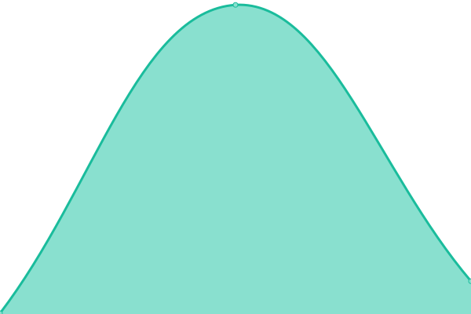
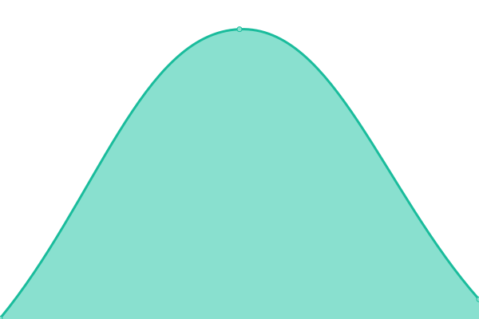

# [📈 Live Status](https://uptime.rejuvicahealth.com): <!--live status--> **🟩 All systems operational**

This repository contains the open-source uptime monitor and status page for [rejuvica](https://uptime.rejuvicahealth.com), powered by [Upptime](https://github.com/upptime/upptime).

With [Upptime](https://upptime.js.org), you can get your own unlimited and free uptime monitor and status page, powered entirely by a GitHub repository. We use [Issues](https://github.com/rejuvica/uptime/issues) as incident reports, [Actions](https://github.com/rejuvica/uptime/actions) as uptime monitors, and [Pages](https://uptime.rejuvicahealth.com) for the status page.

<!--start: status pages-->
<!-- This summary is generated by Upptime (https://github.com/upptime/upptime) -->
<!-- Do not edit this manually, your changes will be overwritten -->
<!-- prettier-ignore -->
| URL | Status | History | Response Time | Uptime |
| --- | ------ | ------- | ------------- | ------ |
|  [Rejuvica Shopify](https://www.rejuvica.com) | 🟩 Up | [rejuvica-shopify.yml](https://github.com/rejuvica/uptime/commits/HEAD/history/rejuvica-shopify.yml) | 

 408ms
     
 | 

<a href="https://uptime.rejuvicahealth.com/history/rejuvica-shopify">100.00%</a>
    

|  [Adrenal Comparison](https://adrenalsupportsupplements.com) | 🟩 Up | [adrenal-comparison.yml](https://github.com/rejuvica/uptime/commits/HEAD/history/adrenal-comparison.yml) | 

 443ms
     
 | 

<a href="https://uptime.rejuvicahealth.com/history/adrenal-comparison">100.00%</a>
    

|  [Adrenal Lander](https://activeadrenal.com) | 🟩 Up | [adrenal-lander.yml](https://github.com/rejuvica/uptime/commits/HEAD/history/adrenal-lander.yml) | 

 108ms
     
 | 

<a href="https://uptime.rejuvicahealth.com/history/adrenal-lander">100.00%</a>
    

|  [Ashwagandha Comparison](https://ashwagandhareviewed.com) | 🟩 Up | [ashwagandha-comparison.yml](https://github.com/rejuvica/uptime/commits/HEAD/history/ashwagandha-comparison.yml) | 

 545ms
     
 | 

<a href="https://uptime.rejuvicahealth.com/history/ashwagandha-comparison">100.00%</a>
    

|  [Ashwagandha Lander](https://goactiveashwagandha.com) | 🟩 Up | [ashwagandha-lander.yml](https://github.com/rejuvica/uptime/commits/HEAD/history/ashwagandha-lander.yml) | 

 162ms
     
 | 

<a href="https://uptime.rejuvicahealth.com/history/ashwagandha-lander">100.00%</a>
    

<!--end: status pages-->

[**Visit our status website →**](https://uptime.rejuvicahealth.com)

## 📄 License

- Powered by: [Upptime](https://github.com/upptime/upptime)
- Code: [MIT](./LICENSE) © [rejuvica](https://uptime.rejuvicahealth.com)
- Data in the `./history` directory: [Open Database License](https://opendatacommons.org/licenses/odbl/1-0/)
