# [📈 Live Status](https://uptime.rejuvicahealth.com): <!--live status--> **🟧 Partial outage**

This repository contains the open-source uptime monitor and status page for [rejuvica](https://uptime.rejuvicahealth.com), powered by [Upptime](https://github.com/upptime/upptime).

With [Upptime](https://upptime.js.org), you can get your own unlimited and free uptime monitor and status page, powered entirely by a GitHub repository. We use [Issues](https://github.com/rejuvica/uptime/issues) as incident reports, [Actions](https://github.com/rejuvica/uptime/actions) as uptime monitors, and [Pages](https://uptime.rejuvicahealth.com) for the status page.

<!--start: status pages-->
<!-- This summary is generated by Upptime (https://github.com/upptime/upptime) -->
<!-- Do not edit this manually, your changes will be overwritten -->
<!-- prettier-ignore -->
| URL | Status | History | Response Time | Uptime |
| --- | ------ | ------- | ------------- | ------ |
|  [Rejuvica Shopify](https://www.rejuvica.com/) | 🟩 Up | [rejuvica-shopify.yml](https://github.com/rejuvica/uptime/commits/HEAD/history/rejuvica-shopify.yml) | 

 489ms
     
 | 

<a href="https://uptime.rejuvicahealth.com/history/rejuvica-shopify">100.00%</a>
    

|  [Active Adrenal](https://activeadrenal.com/) | 🟩 Up | [active-adrenal.yml](https://github.com/rejuvica/uptime/commits/HEAD/history/active-adrenal.yml) | 

 298ms
     
 | 

<a href="https://uptime.rejuvicahealth.com/history/active-adrenal">100.00%</a>
    

|  [Go Active Ashwagandha](https://goactiveashwagandha.com/) | 🟩 Up | [go-active-ashwagandha.yml](https://github.com/rejuvica/uptime/commits/HEAD/history/go-active-ashwagandha.yml) | 

 323ms
     
 | 

<a href="https://uptime.rejuvicahealth.com/history/go-active-ashwagandha">100.00%</a>
    

|  [Redness Redux](https://rednessredux.com/) | 🟩 Up | [redness-redux.yml](https://github.com/rejuvica/uptime/commits/HEAD/history/redness-redux.yml) | 

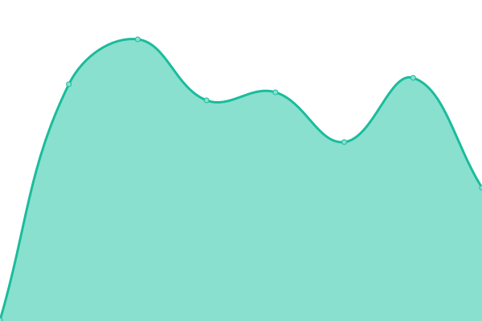 311ms
     
 | 

<a href="https://uptime.rejuvicahealth.com/history/redness-redux">100.00%</a>
    

|  [Bladder Pro](https://bladderpro.com/) | 🟩 Up | [bladder-pro.yml](https://github.com/rejuvica/uptime/commits/HEAD/history/bladder-pro.yml) | 

 310ms
     
 | 

<a href="https://uptime.rejuvicahealth.com/history/bladder-pro">100.00%</a>
    

|  [BloatX](https://bloatx.com/) | 🟩 Up | [bloat-x.yml](https://github.com/rejuvica/uptime/commits/HEAD/history/bloat-x.yml) | 

 314ms
     
 | 

<a href="https://uptime.rejuvicahealth.com/history/bloat-x">100.00%</a>
    

|  [Metaven](https://metaven.com/) | 🟩 Up | [metaven.yml](https://github.com/rejuvica/uptime/commits/HEAD/history/metaven.yml) | 

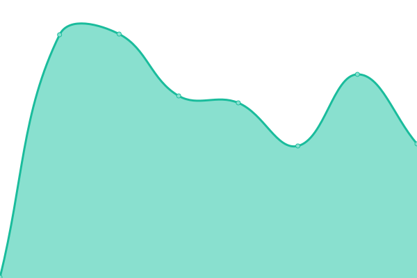 319ms
     
 | 

<a href="https://uptime.rejuvicahealth.com/history/metaven">100.00%</a>
    

|  [Zenapinir](https://zenapinir.com/) | 🟩 Up | [zenapinir.yml](https://github.com/rejuvica/uptime/commits/HEAD/history/zenapinir.yml) | 

 318ms
     
 | 

<a href="https://uptime.rejuvicahealth.com/history/zenapinir">100.00%</a>
    

|  [Deep Therapy Cream](https://deeptherapycream.com/) | 🟩 Up | [deep-therapy-cream.yml](https://github.com/rejuvica/uptime/commits/HEAD/history/deep-therapy-cream.yml) | 

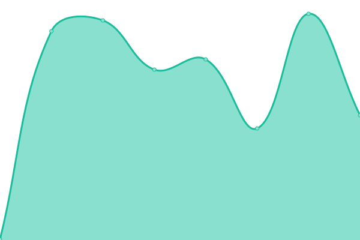 309ms
     
 | 

<a href="https://uptime.rejuvicahealth.com/history/deep-therapy-cream">100.00%</a>
    

|  [Digestapro](https://digestapro.com/) | 🟩 Up | [digestapro.yml](https://github.com/rejuvica/uptime/commits/HEAD/history/digestapro.yml) | 

 317ms
     
 | 

<a href="https://uptime.rejuvicahealth.com/history/digestapro">100.00%</a>
    

|  [Ancient Pet Liver](https://ancientpetliver.com/) | 🟩 Up | [ancient-pet-liver.yml](https://github.com/rejuvica/uptime/commits/HEAD/history/ancient-pet-liver.yml) | 

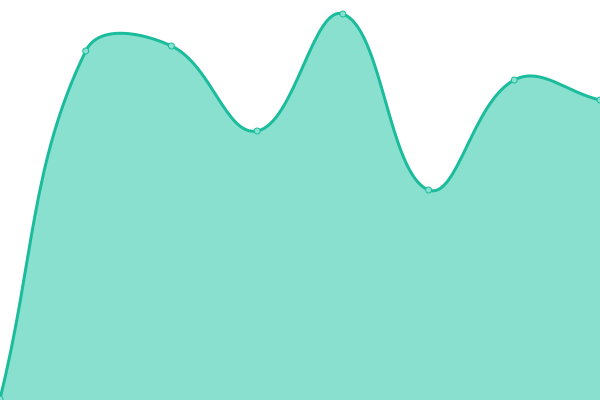 304ms
     
 | 

<a href="https://uptime.rejuvicahealth.com/history/ancient-pet-liver">100.00%</a>
    

|  [Activated Female](https://activatedfemale.com/) | 🟩 Up | [activated-female.yml](https://github.com/rejuvica/uptime/commits/HEAD/history/activated-female.yml) | 

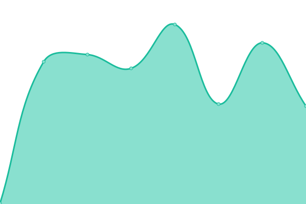 312ms
     
 | 

<a href="https://uptime.rejuvicahealth.com/history/activated-female">100.00%</a>
    

|  [Cleanse Drops](https://cleansedrops.com/) | 🟥 Down | [cleanse-drops.yml](https://github.com/rejuvica/uptime/commits/HEAD/history/cleanse-drops.yml) | 

 387ms
     
 | 

<a href="https://uptime.rejuvicahealth.com/history/cleanse-drops">99.70%</a>
    

|  [Go Active Ginseng](https://goactiveginseng.com/) | 🟩 Up | [go-active-ginseng.yml](https://github.com/rejuvica/uptime/commits/HEAD/history/go-active-ginseng.yml) | 

 303ms
     
 | 

<a href="https://uptime.rejuvicahealth.com/history/go-active-ginseng">100.00%</a>
    

|  [HSN System](https://hsnsystem.com/) | 🟩 Up | [hsn-system.yml](https://github.com/rejuvica/uptime/commits/HEAD/history/hsn-system.yml) | 

 319ms
     
 | 

<a href="https://uptime.rejuvicahealth.com/history/hsn-system">100.00%</a>
    

|  [Cardiovance](https://cardiovance.com/) | 🟩 Up | [cardiovance.yml](https://github.com/rejuvica/uptime/commits/HEAD/history/cardiovance.yml) | 

 311ms
     
 | 

<a href="https://uptime.rejuvicahealth.com/history/cardiovance">100.00%</a>
    

|  [Munomax](https://munomax.com/) | 🟩 Up | [munomax.yml](https://github.com/rejuvica/uptime/commits/HEAD/history/munomax.yml) | 

 311ms
     
 | 

<a href="https://uptime.rejuvicahealth.com/history/munomax">100.00%</a>
    

|  [Intesticlear](https://intesticlear.com/) | 🟩 Up | [intesticlear.yml](https://github.com/rejuvica/uptime/commits/HEAD/history/intesticlear.yml) | 

 309ms
     
 | 

<a href="https://uptime.rejuvicahealth.com/history/intesticlear">100.00%</a>
    

|  [Active Iodine](https://activeiodine.com/) | 🟩 Up | [active-iodine.yml](https://github.com/rejuvica/uptime/commits/HEAD/history/active-iodine.yml) | 

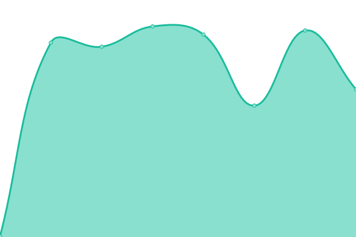 301ms
     
 | 

<a href="https://uptime.rejuvicahealth.com/history/active-iodine">100.00%</a>
    

|  [Active Kava Kava](https://activekavakava.com/) | 🟩 Up | [active-kava-kava.yml](https://github.com/rejuvica/uptime/commits/HEAD/history/active-kava-kava.yml) | 

 300ms
     
 | 

<a href="https://uptime.rejuvicahealth.com/history/active-kava-kava">100.00%</a>
    

|  [Cleanse Drops](http://cleansedrops.com/) | 🟥 Down | [cleanse-drops.yml](https://github.com/rejuvica/uptime/commits/HEAD/history/cleanse-drops.yml) | 

 387ms
     
 | 

<a href="https://uptime.rejuvicahealth.com/history/cleanse-drops">99.68%</a>
    

|  [Vitaliver](https://vitaliver.com/) | 🟩 Up | [vitaliver.yml](https://github.com/rejuvica/uptime/commits/HEAD/history/vitaliver.yml) | 

 322ms
     
 | 

<a href="https://uptime.rejuvicahealth.com/history/vitaliver">100.00%</a>
    

|  [Bright Lungs](https://brightlungs.com/) | 🟩 Up | [bright-lungs.yml](https://github.com/rejuvica/uptime/commits/HEAD/history/bright-lungs.yml) | 

 319ms
     
 | 

<a href="https://uptime.rejuvicahealth.com/history/bright-lungs">100.00%</a>
    

|  [Go Active Maca](https://goactivemaca.com/) | 🟩 Up | [go-active-maca.yml](https://github.com/rejuvica/uptime/commits/HEAD/history/go-active-maca.yml) | 

 313ms
     
 | 

<a href="https://uptime.rejuvicahealth.com/history/go-active-maca">100.00%</a>
    

|  [Activated Male](http://activatedmale.com/) | 🟥 Down | [activated-male.yml](https://github.com/rejuvica/uptime/commits/HEAD/history/activated-male.yml) | 

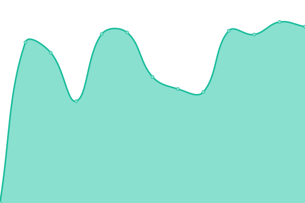 497ms
     
 | 

<a href="https://uptime.rejuvicahealth.com/history/activated-male">99.87%</a>
    

|  [Nerve Factor](https://nervefactor.com/) | 🟩 Up | [nerve-factor.yml](https://github.com/rejuvica/uptime/commits/HEAD/history/nerve-factor.yml) | 

 302ms
     
 | 

<a href="https://uptime.rejuvicahealth.com/history/nerve-factor">100.00%</a>
    

|  [Natal Nourish](https://natalnourish.com/) | 🟩 Up | [natal-nourish.yml](https://github.com/rejuvica/uptime/commits/HEAD/history/natal-nourish.yml) | 

 312ms
     
 | 

<a href="https://uptime.rejuvicahealth.com/history/natal-nourish">100.00%</a>
    

|  [Ocutonic](https://ocutonic.com/) | 🟩 Up | [ocutonic.yml](https://github.com/rejuvica/uptime/commits/HEAD/history/ocutonic.yml) | 

 310ms
     
 | 

<a href="https://uptime.rejuvicahealth.com/history/ocutonic">100.00%</a>
    

|  [Active Olive Leaf](https://activeoliveleaf.com/) | 🟩 Up | [active-olive-leaf.yml](https://github.com/rejuvica/uptime/commits/HEAD/history/active-olive-leaf.yml) | 

 315ms
     
 | 

<a href="https://uptime.rejuvicahealth.com/history/active-olive-leaf">100.00%</a>
    

|  [OraSpark](https://oraspark.com/) | 🟩 Up | [ora-spark.yml](https://github.com/rejuvica/uptime/commits/HEAD/history/ora-spark.yml) | 

 321ms
     
 | 

<a href="https://uptime.rejuvicahealth.com/history/ora-spark">100.00%</a>
    

|  [Active Polygala](https://activepolygala.com/) | 🟩 Up | [active-polygala.yml](https://github.com/rejuvica/uptime/commits/HEAD/history/active-polygala.yml) | 

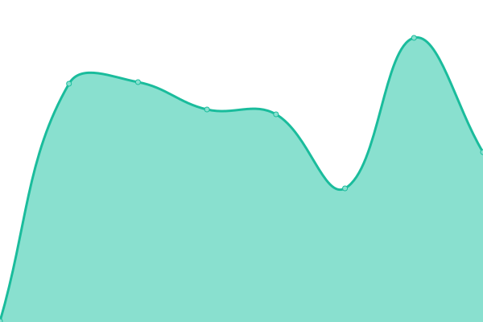 304ms
     
 | 

<a href="https://uptime.rejuvicahealth.com/history/active-polygala">100.00%</a>
    

|  [Active Rhodiola](https://activerhodiola.com/) | 🟩 Up | [active-rhodiola.yml](https://github.com/rejuvica/uptime/commits/HEAD/history/active-rhodiola.yml) | 

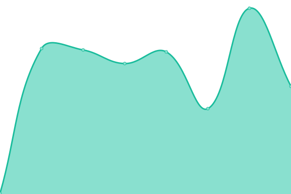 331ms
     
 | 

<a href="https://uptime.rejuvicahealth.com/history/active-rhodiola">100.00%</a>
    

|  [Better Scalp](https://betterscalp.com/) | 🟩 Up | [better-scalp.yml](https://github.com/rejuvica/uptime/commits/HEAD/history/better-scalp.yml) | 

 308ms
     
 | 

<a href="https://uptime.rejuvicahealth.com/history/better-scalp">100.00%</a>
    

|  [Restavin](https://restavin.com/) | 🟩 Up | [restavin.yml](https://github.com/rejuvica/uptime/commits/HEAD/history/restavin.yml) | 

 304ms
     
 | 

<a href="https://uptime.rejuvicahealth.com/history/restavin">100.00%</a>
    

|  [Nocturest](https://nocturest.com/) | 🟩 Up | [nocturest.yml](https://github.com/rejuvica/uptime/commits/HEAD/history/nocturest.yml) | 

 306ms
     
 | 

<a href="https://uptime.rejuvicahealth.com/history/nocturest">100.00%</a>
    

|  [Nervestra](https://nervestra.com/) | 🟩 Up | [nervestra.yml](https://github.com/rejuvica/uptime/commits/HEAD/history/nervestra.yml) | 

 310ms
     
 | 

<a href="https://uptime.rejuvicahealth.com/history/nervestra">100.00%</a>
    

|  [Prostavec](https://prostavec.com/) | 🟩 Up | [prostavec.yml](https://github.com/rejuvica/uptime/commits/HEAD/history/prostavec.yml) | 

 296ms
     
 | 

<a href="https://uptime.rejuvicahealth.com/history/prostavec">100.00%</a>
    

|  [Thyrobin](https://thyrobin.com/) | 🟩 Up | [thyrobin.yml](https://github.com/rejuvica/uptime/commits/HEAD/history/thyrobin.yml) | 

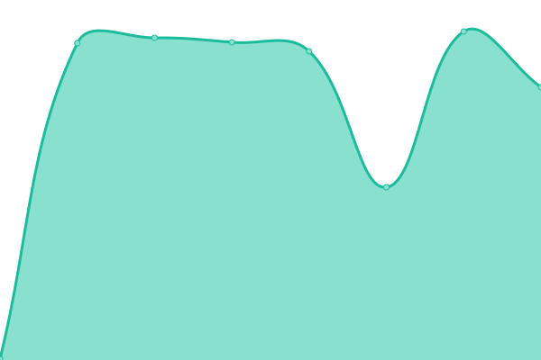 320ms
     
 | 

<a href="https://uptime.rejuvicahealth.com/history/thyrobin">100.00%</a>
    

|  [Uricel](https://uricel.com/) | 🟩 Up | [uricel.yml](https://github.com/rejuvica/uptime/commits/HEAD/history/uricel.yml) | 

 301ms
     
 | 

<a href="https://uptime.rejuvicahealth.com/history/uricel">100.00%</a>
    

|  [Balanced Femme](https://balancedfemme.com/) | 🟩 Up | [balanced-femme.yml](https://github.com/rejuvica/uptime/commits/HEAD/history/balanced-femme.yml) | 

 315ms
     
 | 

<a href="https://uptime.rejuvicahealth.com/history/balanced-femme">100.00%</a>
    

|  [Cherry Force](https://cherryforce.com/) | 🟩 Up | [cherry-force.yml](https://github.com/rejuvica/uptime/commits/HEAD/history/cherry-force.yml) | 

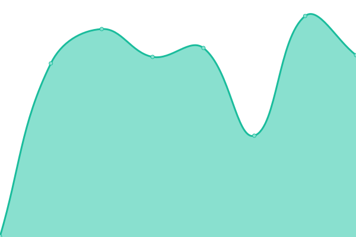 312ms
     
 | 

<a href="https://uptime.rejuvicahealth.com/history/cherry-force">100.00%</a>
    

|  [Better Nail](https://betternail.com/) | 🟩 Up | [better-nail.yml](https://github.com/rejuvica/uptime/commits/HEAD/history/better-nail.yml) | 

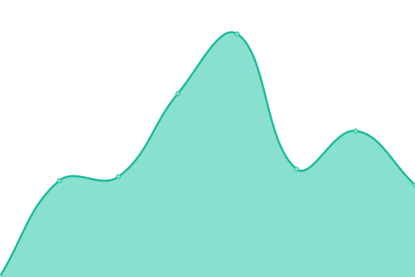 322ms
     
 | 

<a href="https://uptime.rejuvicahealth.com/history/better-nail">100.00%</a>
    

|  [Active Turmeric](https://activeturmeric.com/) | 🟩 Up | [active-turmeric.yml](https://github.com/rejuvica/uptime/commits/HEAD/history/active-turmeric.yml) | 

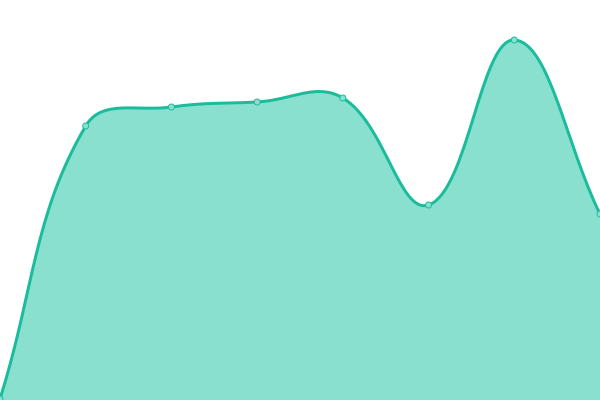 317ms
     
 | 

<a href="https://uptime.rejuvicahealth.com/history/active-turmeric">100.00%</a>
    

|  [Varicol](https://varicol.com/) | 🟩 Up | [varicol.yml](https://github.com/rejuvica/uptime/commits/HEAD/history/varicol.yml) | 

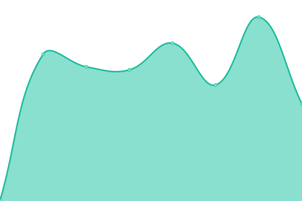 325ms
     
 | 

<a href="https://uptime.rejuvicahealth.com/history/varicol">100.00%</a>
    

|  [Hydrocin](https://hydrocin.com/) | 🟩 Up | [hydrocin.yml](https://github.com/rejuvica/uptime/commits/HEAD/history/hydrocin.yml) | 

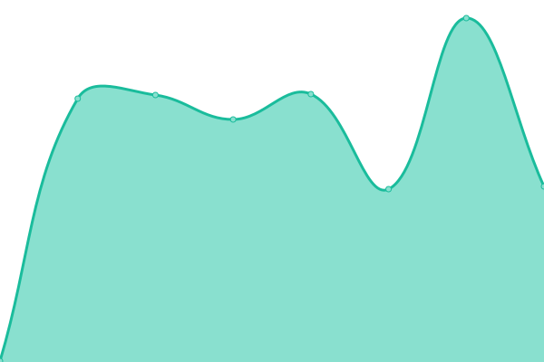 287ms
     
 | 

<a href="https://uptime.rejuvicahealth.com/history/hydrocin">100.00%</a>
    

<!--end: status pages-->

[**Visit our status website →**](https://uptime.rejuvicahealth.com)

## 📄 License

- Powered by: [Upptime](https://github.com/upptime/upptime)
- Code: [MIT](./LICENSE) © [rejuvica](https://uptime.rejuvicahealth.com)
- Data in the `./history` directory: [Open Database License](https://opendatacommons.org/licenses/odbl/1-0/)
