# [📈 Live Status](https://uptime.rejuvicahealth.com): <!--live status--> **🟩 All systems operational**

This repository contains the open-source uptime monitor and status page for [rejuvica](https://uptime.rejuvicahealth.com), powered by [Upptime](https://github.com/upptime/upptime).

With [Upptime](https://upptime.js.org), you can get your own unlimited and free uptime monitor and status page, powered entirely by a GitHub repository. We use [Issues](https://github.com/rejuvica/uptime/issues) as incident reports, [Actions](https://github.com/rejuvica/uptime/actions) as uptime monitors, and [Pages](https://uptime.rejuvicahealth.com) for the status page.

<!--start: status pages-->
<!-- This summary is generated by Upptime (https://github.com/upptime/upptime) -->
<!-- Do not edit this manually, your changes will be overwritten -->
<!-- prettier-ignore -->
| URL | Status | History | Response Time | Uptime |
| --- | ------ | ------- | ------------- | ------ |
|  [Rejuvica Shopify](https://www.rejuvica.com/) | 🟩 Up | [rejuvica-shopify.yml](https://github.com/RJVCA/uptime/commits/HEAD/history/rejuvica-shopify.yml) | 

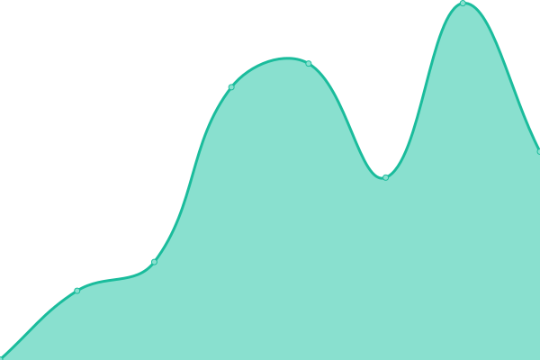 421ms
     
 | 

<a href="https://uptime.rejuvicahealth.com/history/rejuvica-shopify">100.00%</a>
    

|  [Dermaced Shopify](https://dermaced.com/) | 🟩 Up | [dermaced-shopify.yml](https://github.com/RJVCA/uptime/commits/HEAD/history/dermaced-shopify.yml) | 

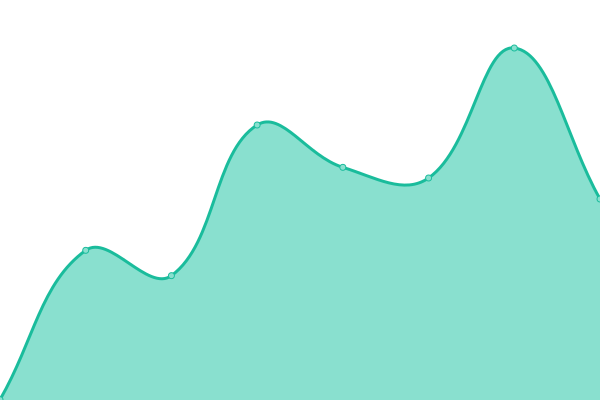 556ms
     
 | 

<a href="https://uptime.rejuvicahealth.com/history/dermaced-shopify">99.43%</a>
    

|  [Active Adrenal](https://activeadrenal.com/) | 🟩 Up | [active-adrenal.yml](https://github.com/RJVCA/uptime/commits/HEAD/history/active-adrenal.yml) | 

 298ms
     
 | 

<a href="https://uptime.rejuvicahealth.com/history/active-adrenal">99.16%</a>
    

|  [Go Active Ashwagandha](https://goactiveashwagandha.com/) | 🟩 Up | [go-active-ashwagandha.yml](https://github.com/RJVCA/uptime/commits/HEAD/history/go-active-ashwagandha.yml) | 

 287ms
     
 | 

<a href="https://uptime.rejuvicahealth.com/history/go-active-ashwagandha">99.17%</a>
    

|  [Redness Redux](https://rednessredux.com/) | 🟩 Up | [redness-redux.yml](https://github.com/RJVCA/uptime/commits/HEAD/history/redness-redux.yml) | 

 289ms
     
 | 

<a href="https://uptime.rejuvicahealth.com/history/redness-redux">99.18%</a>
    

|  [Bladder Pro](https://bladderpro.com/) | 🟩 Up | [bladder-pro.yml](https://github.com/RJVCA/uptime/commits/HEAD/history/bladder-pro.yml) | 

 295ms
     
 | 

<a href="https://uptime.rejuvicahealth.com/history/bladder-pro">99.19%</a>
    

|  [BloatX](https://bloatx.com/) | 🟩 Up | [bloat-x.yml](https://github.com/RJVCA/uptime/commits/HEAD/history/bloat-x.yml) | 

 1036ms
     
 | 

<a href="https://uptime.rejuvicahealth.com/history/bloat-x">99.20%</a>
    

|  [Metaven](https://metaven.com/) | 🟩 Up | [metaven.yml](https://github.com/RJVCA/uptime/commits/HEAD/history/metaven.yml) | 

 283ms
     
 | 

<a href="https://uptime.rejuvicahealth.com/history/metaven">99.21%</a>
    

|  [Zenapin-IR](https://zenapinir.com/) | 🟩 Up | [zenapin-ir.yml](https://github.com/RJVCA/uptime/commits/HEAD/history/zenapin-ir.yml) | 

 284ms
     
 | 

<a href="https://uptime.rejuvicahealth.com/history/zenapin-ir">99.50%</a>
    

|  [Deep Therapy Cream](https://deeptherapycream.com/) | 🟩 Up | [deep-therapy-cream.yml](https://github.com/RJVCA/uptime/commits/HEAD/history/deep-therapy-cream.yml) | 

 268ms
     
 | 

<a href="https://uptime.rejuvicahealth.com/history/deep-therapy-cream">99.51%</a>
    

|  [DigestaPro](https://digestapro.com/) | 🟩 Up | [digesta-pro.yml](https://github.com/RJVCA/uptime/commits/HEAD/history/digesta-pro.yml) | 

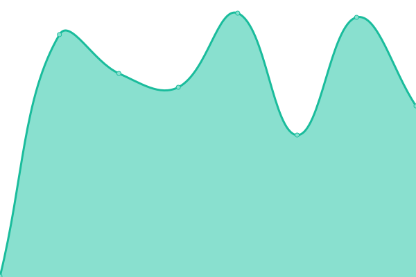 281ms
     
 | 

<a href="https://uptime.rejuvicahealth.com/history/digesta-pro">99.52%</a>
    

|  [Ancient Pet Liver](https://ancientpetliver.com/) | 🟩 Up | [ancient-pet-liver.yml](https://github.com/RJVCA/uptime/commits/HEAD/history/ancient-pet-liver.yml) | 

 279ms
     
 | 

<a href="https://uptime.rejuvicahealth.com/history/ancient-pet-liver">99.53%</a>
    

|  [Activated Female](https://activatedfemale.com/) | 🟩 Up | [activated-female.yml](https://github.com/RJVCA/uptime/commits/HEAD/history/activated-female.yml) | 

 262ms
     
 | 

<a href="https://uptime.rejuvicahealth.com/history/activated-female">99.54%</a>
    

|  [Cleanse Drops](https://cleansedrops.com/) | 🟩 Up | [cleanse-drops.yml](https://github.com/RJVCA/uptime/commits/HEAD/history/cleanse-drops.yml) | 

 1059ms
     
 | 

<a href="https://uptime.rejuvicahealth.com/history/cleanse-drops">99.55%</a>
    

|  [Go Active Ginseng](https://goactiveginseng.com/) | 🟩 Up | [go-active-ginseng.yml](https://github.com/RJVCA/uptime/commits/HEAD/history/go-active-ginseng.yml) | 

 275ms
     
 | 

<a href="https://uptime.rejuvicahealth.com/history/go-active-ginseng">99.56%</a>
    

|  [HSN System](https://hsnsystem.com/) | 🟩 Up | [hsn-system.yml](https://github.com/RJVCA/uptime/commits/HEAD/history/hsn-system.yml) | 

 290ms
     
 | 

<a href="https://uptime.rejuvicahealth.com/history/hsn-system">99.57%</a>
    

|  [CardioVance](https://cardiovance.com/) | 🟩 Up | [cardio-vance.yml](https://github.com/RJVCA/uptime/commits/HEAD/history/cardio-vance.yml) | 

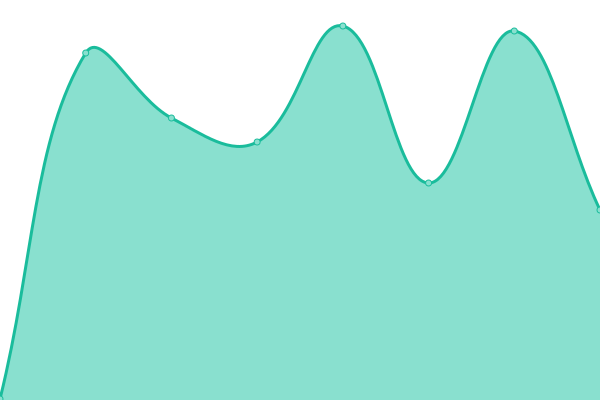 307ms
     
 | 

<a href="https://uptime.rejuvicahealth.com/history/cardio-vance">99.58%</a>
    

|  [MunoMax](https://munomax.com/) | 🟩 Up | [muno-max.yml](https://github.com/RJVCA/uptime/commits/HEAD/history/muno-max.yml) | 

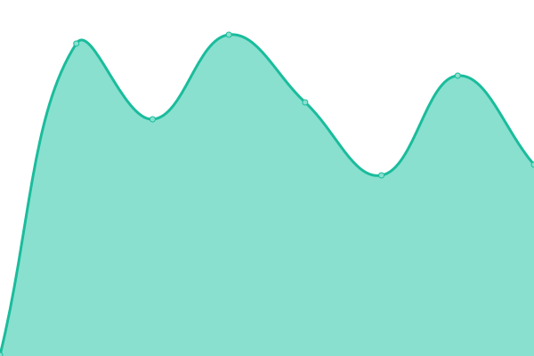 280ms
     
 | 

<a href="https://uptime.rejuvicahealth.com/history/muno-max">99.59%</a>
    

|  [IntestiClear](https://intesticlear.com/) | 🟩 Up | [intesti-clear.yml](https://github.com/RJVCA/uptime/commits/HEAD/history/intesti-clear.yml) | 

 267ms
     
 | 

<a href="https://uptime.rejuvicahealth.com/history/intesti-clear">99.60%</a>
    

|  [Active Iodine](https://activeiodine.com/) | 🟩 Up | [active-iodine.yml](https://github.com/RJVCA/uptime/commits/HEAD/history/active-iodine.yml) | 

 276ms
     
 | 

<a href="https://uptime.rejuvicahealth.com/history/active-iodine">99.60%</a>
    

|  [Active Kava Kava](https://activekavakava.com/) | 🟩 Up | [active-kava-kava.yml](https://github.com/RJVCA/uptime/commits/HEAD/history/active-kava-kava.yml) | 

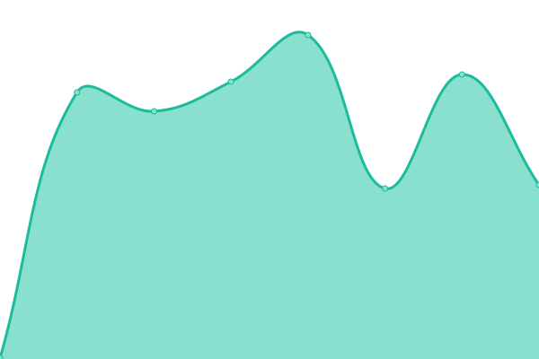 293ms
     
 | 

<a href="https://uptime.rejuvicahealth.com/history/active-kava-kava">99.61%</a>
    

|  [Cleanse Drops Kidney](http://cleansedropskidney.com/) | 🟩 Up | [cleanse-drops-kidney.yml](https://github.com/RJVCA/uptime/commits/HEAD/history/cleanse-drops-kidney.yml) | 

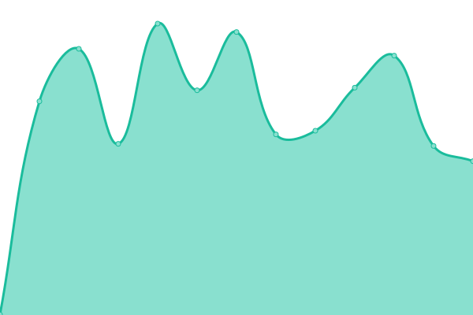 415ms
     
 | 

<a href="https://uptime.rejuvicahealth.com/history/cleanse-drops-kidney">64.46%</a>
    

|  [VitaLiver](https://vitaliver.com/) | 🟩 Up | [vita-liver.yml](https://github.com/RJVCA/uptime/commits/HEAD/history/vita-liver.yml) | 

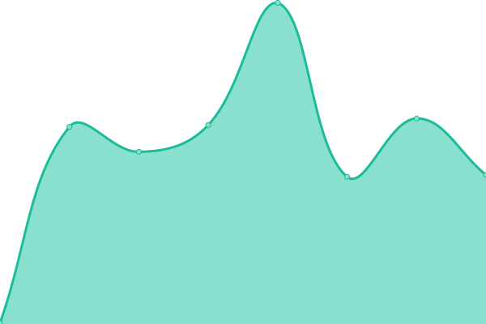 242ms
     
 | 

<a href="https://uptime.rejuvicahealth.com/history/vita-liver">99.63%</a>
    

|  [Bright Lungs](https://brightlungs.com/) | 🟩 Up | [bright-lungs.yml](https://github.com/RJVCA/uptime/commits/HEAD/history/bright-lungs.yml) | 

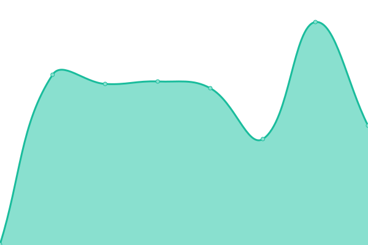 291ms
     
 | 

<a href="https://uptime.rejuvicahealth.com/history/bright-lungs">99.64%</a>
    

|  [Go Active Maca](https://goactivemaca.com/) | 🟩 Up | [go-active-maca.yml](https://github.com/RJVCA/uptime/commits/HEAD/history/go-active-maca.yml) | 

 279ms
     
 | 

<a href="https://uptime.rejuvicahealth.com/history/go-active-maca">99.65%</a>
    

|  [Activated Male](http://activatedmale.com/) | 🟩 Up | [activated-male.yml](https://github.com/RJVCA/uptime/commits/HEAD/history/activated-male.yml) | 

 545ms
     
 | 

<a href="https://uptime.rejuvicahealth.com/history/activated-male">65.38%</a>
    

|  [Nerve Factor](https://nervefactor.com/) | 🟩 Up | [nerve-factor.yml](https://github.com/RJVCA/uptime/commits/HEAD/history/nerve-factor.yml) | 

 250ms
     
 | 

<a href="https://uptime.rejuvicahealth.com/history/nerve-factor">99.81%</a>
    

|  [Natal Nourish](https://natalnourish.com/) | 🟩 Up | [natal-nourish.yml](https://github.com/RJVCA/uptime/commits/HEAD/history/natal-nourish.yml) | 

 302ms
     
 | 

<a href="https://uptime.rejuvicahealth.com/history/natal-nourish">99.82%</a>
    

|  [Total Soothe](https://totalsoothe.com/) | 🟩 Up | [total-soothe.yml](https://github.com/RJVCA/uptime/commits/HEAD/history/total-soothe.yml) | 

 272ms
     
 | 

<a href="https://uptime.rejuvicahealth.com/history/total-soothe">99.47%</a>
    

|  [Ocutonic](https://ocutonic.com/) | 🟩 Up | [ocutonic.yml](https://github.com/RJVCA/uptime/commits/HEAD/history/ocutonic.yml) | 

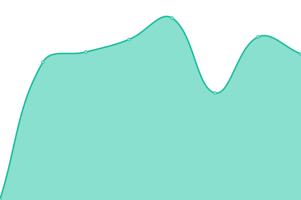 284ms
     
 | 

<a href="https://uptime.rejuvicahealth.com/history/ocutonic">99.48%</a>
    

|  [Active Olive Leaf](https://activeoliveleaf.com/) | 🟩 Up | [active-olive-leaf.yml](https://github.com/RJVCA/uptime/commits/HEAD/history/active-olive-leaf.yml) | 

 281ms
     
 | 

<a href="https://uptime.rejuvicahealth.com/history/active-olive-leaf">99.48%</a>
    

|  [Active Polygala](https://activepolygala.com/) | 🟩 Up | [active-polygala.yml](https://github.com/RJVCA/uptime/commits/HEAD/history/active-polygala.yml) | 

 276ms
     
 | 

<a href="https://uptime.rejuvicahealth.com/history/active-polygala">99.49%</a>
    

|  [Active Rhodiola](https://activerhodiola.com/) | 🟩 Up | [active-rhodiola.yml](https://github.com/RJVCA/uptime/commits/HEAD/history/active-rhodiola.yml) | 

 245ms
     
 | 

<a href="https://uptime.rejuvicahealth.com/history/active-rhodiola">99.49%</a>
    

|  [Better Scalp](https://betterscalp.com/) | 🟩 Up | [better-scalp.yml](https://github.com/RJVCA/uptime/commits/HEAD/history/better-scalp.yml) | 

 278ms
     
 | 

<a href="https://uptime.rejuvicahealth.com/history/better-scalp">99.50%</a>
    

|  [Restavin](https://restavin.com/) | 🟩 Up | [restavin.yml](https://github.com/RJVCA/uptime/commits/HEAD/history/restavin.yml) | 

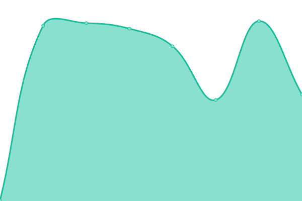 266ms
     
 | 

<a href="https://uptime.rejuvicahealth.com/history/restavin">99.50%</a>
    

|  [NoctuRest](https://nocturest.com/) | 🟩 Up | [noctu-rest.yml](https://github.com/RJVCA/uptime/commits/HEAD/history/noctu-rest.yml) | 

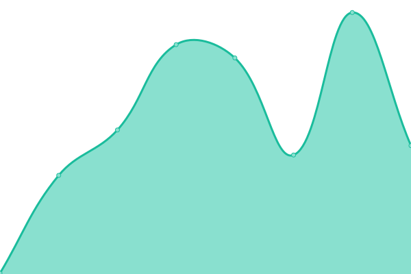 277ms
     
 | 

<a href="https://uptime.rejuvicahealth.com/history/noctu-rest">99.65%</a>
    

|  [Nervestra](https://nervestra.com/) | 🟩 Up | [nervestra.yml](https://github.com/RJVCA/uptime/commits/HEAD/history/nervestra.yml) | 

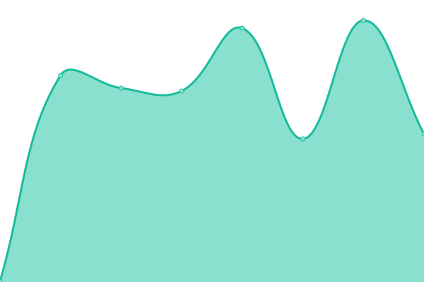 268ms
     
 | 

<a href="https://uptime.rejuvicahealth.com/history/nervestra">99.65%</a>
    

|  [Prostavec](https://prostavec.com/) | 🟩 Up | [prostavec.yml](https://github.com/RJVCA/uptime/commits/HEAD/history/prostavec.yml) | 

 269ms
     
 | 

<a href="https://uptime.rejuvicahealth.com/history/prostavec">99.65%</a>
    

|  [Thyrobin](https://thyrobin.com/) | 🟩 Up | [thyrobin.yml](https://github.com/RJVCA/uptime/commits/HEAD/history/thyrobin.yml) | 

 243ms
     
 | 

<a href="https://uptime.rejuvicahealth.com/history/thyrobin">99.65%</a>
    

|  [Uricel](https://uricel.com/) | 🟩 Up | [uricel.yml](https://github.com/RJVCA/uptime/commits/HEAD/history/uricel.yml) | 

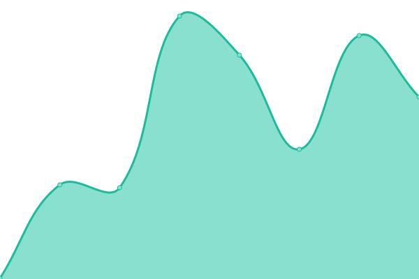 282ms
     
 | 

<a href="https://uptime.rejuvicahealth.com/history/uricel">99.65%</a>
    

|  [Balanced Femme](https://balancedfemme.com/) | 🟩 Up | [balanced-femme.yml](https://github.com/RJVCA/uptime/commits/HEAD/history/balanced-femme.yml) | 

 269ms
     
 | 

<a href="https://uptime.rejuvicahealth.com/history/balanced-femme">99.65%</a>
    

|  [Cherry Force](https://cherryforce.com/) | 🟩 Up | [cherry-force.yml](https://github.com/RJVCA/uptime/commits/HEAD/history/cherry-force.yml) | 

 281ms
     
 | 

<a href="https://uptime.rejuvicahealth.com/history/cherry-force">99.65%</a>
    

|  [Better Nail](https://betternail.com/) | 🟩 Up | [better-nail.yml](https://github.com/RJVCA/uptime/commits/HEAD/history/better-nail.yml) | 

 260ms
     
 | 

<a href="https://uptime.rejuvicahealth.com/history/better-nail">99.65%</a>
    

|  [Active Turmeric](https://activeturmeric.com/) | 🟩 Up | [active-turmeric.yml](https://github.com/RJVCA/uptime/commits/HEAD/history/active-turmeric.yml) | 

 1027ms
     
 | 

<a href="https://uptime.rejuvicahealth.com/history/active-turmeric">99.65%</a>
    

|  [Varicol](https://varicol.com/) | 🟩 Up | [varicol.yml](https://github.com/RJVCA/uptime/commits/HEAD/history/varicol.yml) | 

 1132ms
     
 | 

<a href="https://uptime.rejuvicahealth.com/history/varicol">99.65%</a>
    

|  [Hydrocin](https://hydrocin.com/) | 🟩 Up | [hydrocin.yml](https://github.com/RJVCA/uptime/commits/HEAD/history/hydrocin.yml) | 

 1195ms
     
 | 

<a href="https://uptime.rejuvicahealth.com/history/hydrocin">99.65%</a>
    

<!--end: status pages-->

[**Visit our status website →**](https://uptime.rejuvicahealth.com)

## 📄 License

- Powered by: [Upptime](https://github.com/upptime/upptime)
- Code: [MIT](./LICENSE) © [rejuvica](https://uptime.rejuvicahealth.com)
- Data in the `./history` directory: [Open Database License](https://opendatacommons.org/licenses/odbl/1-0/)
